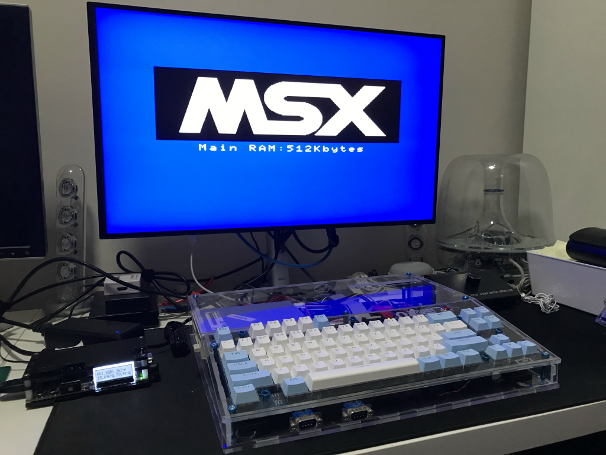

# Omega Home Computer XXXL Acrylic Case

Acrylic case of size XXXL, from now on X3L, for the [Omega Home Computer](https://github.com/skiselev/omega).

## Introduction

This is a new acrylic case design[^1] for the Omega Home Computer based on [Capsule5000 XL version](https://github.com/msx-solis/OMEGA-long-case/tree/main/Capsule_XL_current_version), specifically on the Omega-Eco2_SME_51mm_simple_22_09_2021_slot_trasero.dxf design, adding the following extra features:

* the [dc-adapter 1.5-1.6b](https://msxmakers.design.blog/proyectos/omega-home-computer/mini-fuente-dc-dc/) can be installed in the ["inverted-power-barrel"](https://msxmakers.design.blog/proyectos/omega-home-computer/mini-fuente-dc-dc/#barril) configuration without colliding with the floppy disk drive
* the dc-adapter can also be installed in alternate locations using a panel mount power connector (or even the ["anchored-switch"](https://msxmakers.design.blog/proyectos/omega-home-computer/mini-fuente-dc-dc/#anclado) configuration)
* a bigger cutout allows to accomodate the larger rectangular form of the [power SPDT switch 3-pin copper](https://www.aliexpress.com/item/1005001667810183.html) used in the dc-adapter 1.5-1.6b kit
* taller ESR capacitors can be used, with or sans the [multimedia hat](https://msxmakersdesign.files.wordpress.com/2021/09/mmedia_hat_v1.jpg), without colliding with the floppy disk drive
* extra space bellow the floppy disk drive allows a taller and full length heat sink to be installed on top of the VDP if required
* new vent holes below the motherboard VDP footprint are provided for better air flow
* the floppy disk tray is secured to prevent vertical movement irrespective of the floppy disk drive height
* the reset switch has been moved to the keyboard plate, in line with most MSX computers equipped with a reset switch
* all connectors are labeled (using the [MSX font](https://www.msx.org/wiki/MSX_font))[^2]
* the Omega and MSX logos are also incorporated
* (need to be tested) the floppy disk tray has been re-designed trying to remain compatible with the F4/FMPAC v2 hat
* (need to be tested) enough clearance has been kept trying to remain compatible with the O4MEGA v2 hat
* a companion tray has been designed to ease the placement of the dc-adapter 1.5-1.6b (which lacks screw holes on the PCB)

## Dimensions

Dimensions of Capsule5000 XL case

* width  : 360.0 mm
* height :  60.6 mm
* depth  : 287.8 mm

Dimensions of X3L case

* width  : 360.0 mm
* height :  60.6 mm
* depth  : 312.0 mm (+24.2 mm)

## Status

* The case has been built and is fully functional
* The F4/FMPAC v2 compatibility remains untested until a hat is available for testing
* The O4MEGA v2 compatibility remains untested until a hat is available for testing

## Documentation

[Build instructions](Build.md)

[^1]: The case was designed using the [LibreCAD](https://librecad.org/) CAD application.  
[^2]: This [MSX font in TTF format](http://www.ateijelo.com/blog/2016/09/13/making-an-msx-font) was [converted to LFF](https://github.com/LibreCAD/LibreCAD/tree/master/tools/ttf2lff) for use within LibreCAD.

