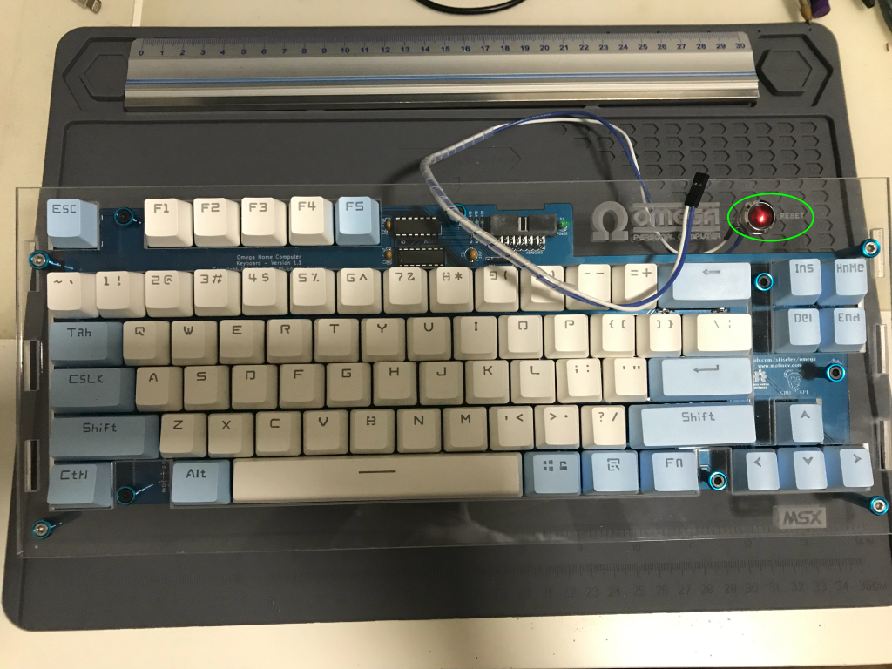

# Build Instructions

This document describes how to assemble a X3L case for the Omega Home Computer.

## Bill of Materials (BoM)

### Acrylic parts

#### [Computer case (4mm thickness)](omega-case-x3l-v1-case-with-rear-slot-4mm+ready-to-lasercut-msx-font-normal-final.dxf)

The X3L Computer case for the Omega Home Computer is made up of seven panels:  
* Rear panel (where all the rear connectors are placed)
  * Dimensions: 360.00mm x 60.60mm x 4mm
* Left panel (where the floppy disk drive front is located)
  * Dimensions: 303.95mm x 60.60mm
* Right panel (where the audio/video knobs are attached)
  * Dimensions: 303.95mm x 60.60mm
* Front panel (where the joystick ports are secured)
  * Dimensions: 360.00mm x 28.96mm
* Bottom panel (where the motherboard sits)
  * Dimensions: 360.00mm x 312.00mm
* Top back panel (where the top slot is located)
  * Dimensions: 360.00mm x 165.76mm
* Top keyboard panel (where the keyboard is attached)
  * Dimensions: 360.00mm x 148.92mm

### Laser cutting

The Omega Computer X3L case CAD design requires a 4mm thick acrylic sheet and has 20 layers that must be processed in this order:

|    Layer Name           | Color | Operation | Required    |             Comment               | Processing Order |
|:------------------------:|-------|:---------:|-------------|:--------------------------------:|:----------------:|
| engraving-raster         | blue  |  engrave  | recommended | Rasterized fonts                 |         1        |
| engraving-raster-msxlogo | blue  |  engrave  | recommended | MSX logo                         |         2        |
| engraving-vector         | cyan  |  engrave  | recommended | Vectorized fonts                 |         3        |
| case-top-keyb-int-1      | red   |    cut    | mandatory   | internal cuts for spacers        |         4        |
| case-top-keyb-int-2      | red   |    cut    | mandatory   | external cuts for spacers        |         5        |
| case-top-keyb-int-3      | red   |    cut    | mandatory   | internal cuts for keyboard plate |         6        |
| *-int (7 layers)         | red   |    cut    | mandatory   | internal cuts                    |         7        |
| *-ext (7 layers)         | green |    cut    | mandatory   | external cuts                    |         8        |

### Mechanical parts

TBD

## Step by step instructions

### Keyboard

1. Prepare to attach to the keyboard board the six spacers/posts required for the keyboard panel

The spacers sit on the keyboard board top side and are fastened via screws on the bottom side. The keyboard panel then sits on top of the spacers.  
Prepare the following parts and place the keyboard board upside down:

  * 10x M3 8mm flat torx screws
  * 10x M3 10mm female-female posts

2. Fasten the six screws on the keyboard board bottom side to the six spacers/posts on the keyboard board top side

3.  Turn the keyboard and check that the spacers/posts are correcly fastened

4. Place the keyboard panel on top of the keyboard board and prepare tu secure it with six screws through the previously installed spacers

Prepare the following parts:
  * 6x M3 8mm countersunk torx screws
  * 6x M3 countersunk washers

5. Fasten the six screws to attach the keyboard panel to the keyboard board spacers and prepare to install the vertical posts that will secure the keyboard panel to the computer case

Prepare the following parts:
  * 4x M3 8mm countersunk torx screws
  * 4x M3 countersunk washers
  * 2x M3 25mm female-female posts (low half pair, on holes 2 and 3)
  * 2x M3 45mm female-female posts (high half pair, on holes 1 and 4)

6. Fasten the four screws on the keyboard panel top side to the spacers/posts on the keyboard panel bottom side

The 45mm posts on the high half and the 25mm posts on the bottom half provide a comfortable/ergonomic angled position for the keyboard.

7. Turn the keyboard panel upside down and check that the spacers/posts are correcly fastened

8. Turn the keyboard again and prepare to attach the reset switch to the keyboard panel

The reset switch is a panel mount momentary push switch that attaches via a dupond two pin female connector to the RST header on the computer motherboard.  
The cable length for the reset switch should be long enough (about 35cm) to allow the keyboard panel to be placed aside the computer without having to disconnect it.

Prepare the following parts:
  * 1x panel mount reset switch with cable and dupond female connector

9. Attach the reset switch to the keyboard panel reset switch hole

### Rest of Computer

TBD

