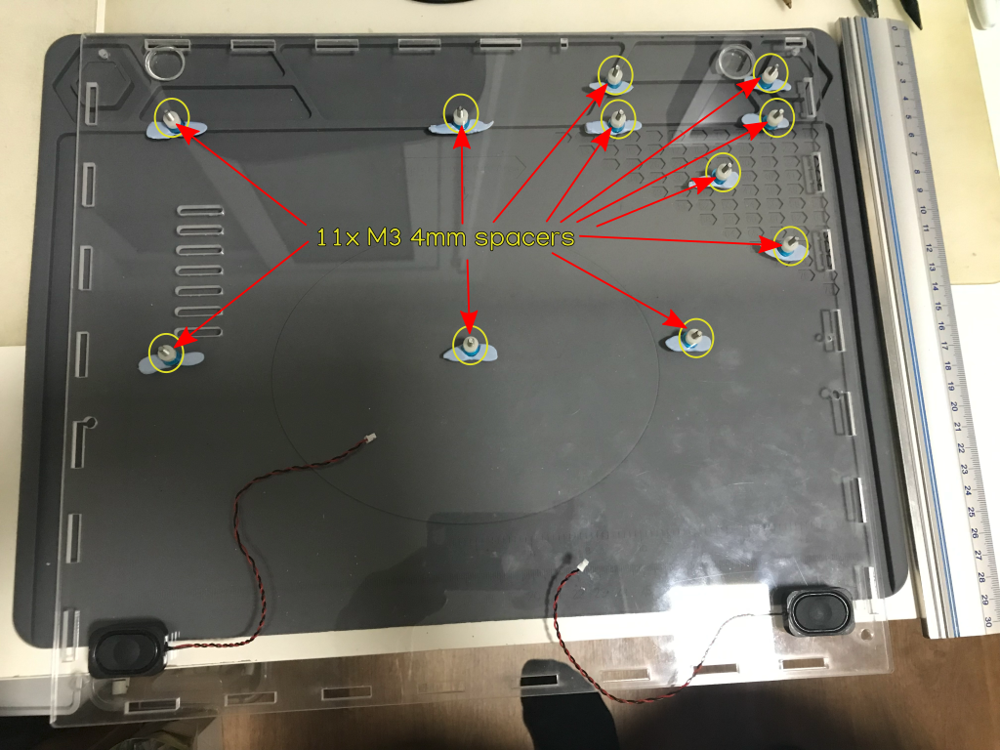
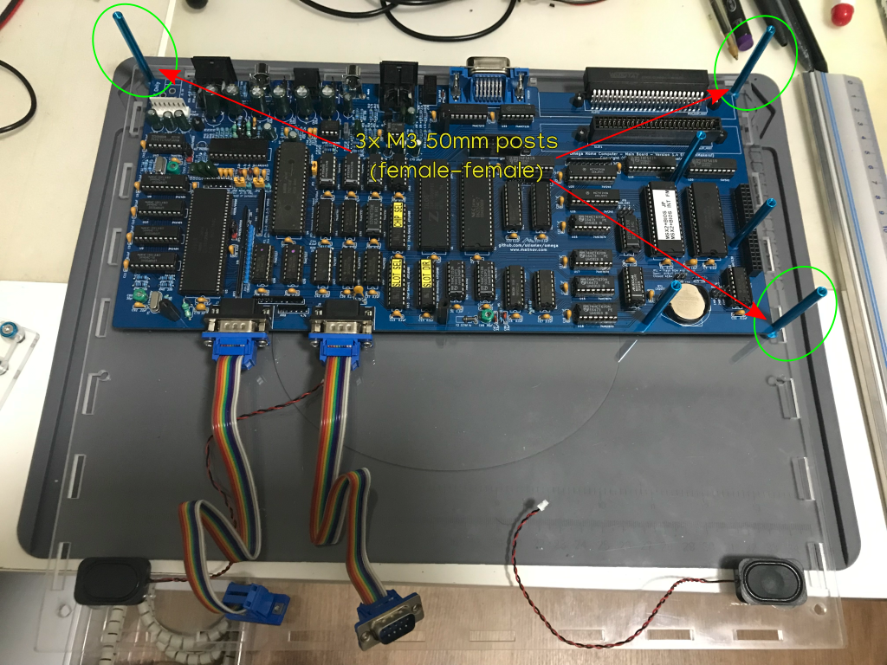
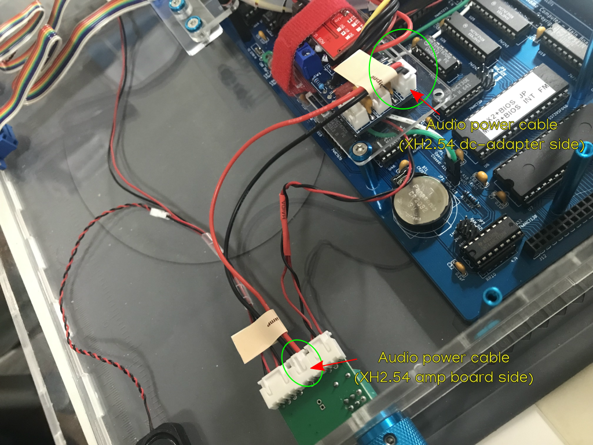
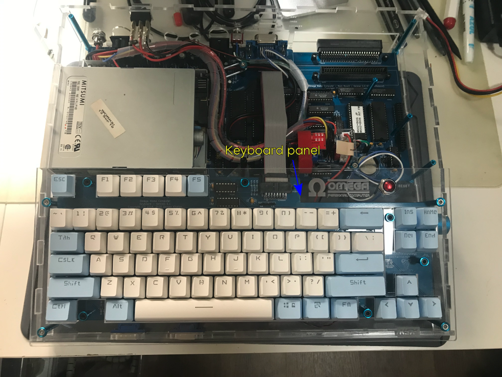

# Build Instructions for the X3L Computer Case

This document describes how to assemble a X3L case for the Omega Home Computer.

## Bill of Materials (BoM)

### Acrylic parts

#### Computer case (4mm thickness)

The [X3L Computer case](omega-case-x3l-v1-case-with-rear-slot-4mm+ready-to-lasercut-msx-font-normal-final.dxf) for the Omega Home Computer is made up of seven panels:  
* Rear panel (where all the rear connectors are placed)
  * Dimensions: 360.00mm x 60.60mm x 4mm
* Left panel (where the floppy disk drive front is located)
  * Dimensions: 303.95mm x 60.60mm
* Right panel (where the audio/video knobs are attached)
  * Dimensions: 303.95mm x 60.60mm
* Front panel (where the joystick ports are secured)
  * Dimensions: 360.00mm x 28.96mm
* Bottom panel (where the motherboard sits)
  * Dimensions: 360.00mm x 312.00mm
* Top panel (where the top slot is located)
  * Dimensions: 360.00mm x 165.76mm
* Keyboard panel (where the keyboard is attached)
  * Dimensions: 360.00mm x 148.92mm

 

### Laser cutting

The Omega Computer X3L case CAD design requires a 4mm thick acrylic sheet and has 20 layers that must be processed in this order:

|    Layer Name           | Color | Operation | Required    |             Comment               | Processing Order |
|:------------------------:|-------|:---------:|-------------|:--------------------------------:|:----------------:|
| engraving-raster         | blue  |  engrave  | recommended | Rasterized fonts                 |         1        |
| engraving-raster-msxlogo | blue  |  engrave  | recommended | MSX logo                         |         2        |
| engraving-vector         | cyan  |  engrave  | recommended | Vectorized fonts                 |         3        |
| case-top-keyb-int-1      | red   |    cut    | mandatory   | internal cuts for spacers        |         4        |
| case-top-keyb-int-2      | red   |    cut    | mandatory   | external cuts for spacers        |         5        |
| case-top-keyb-int-3      | red   |    cut    | mandatory   | internal cuts for keyboard plate |         6        |
| *-int (7 layers)         | red   |    cut    | mandatory   | internal cuts                    |         7        |
| *-ext (7 layers)         | green |    cut    | mandatory   | external cuts                    |         8        |

### Tools

I used the following tools to build the Omega computer case:

* torx screwdriver (8x60)
* philips screwdriver
* wire stripper & cutter (Stanley FatMax)
* soldering station (Yihua 908D)
* hot air gun
* JST1.25 crimping tool (IWS-2820M)
* XH2.54 crimping tool (SN-01BM)
* Dupont crimping tool (SN-28B)
* portable drilling machine with countersink 20.5mm drill bit for acrylic

### Mechanical parts

TBD

## Step by step instructions

### Keyboard

1. Prepare to attach the keyboard board to the keyboard panel using six posts/spacers

The six posts sit on the keyboard board top side and are fastened via screws on the bottom side. The keyboard panel then sits on top of the posts.  

Place the keyboard board upside down and prepare the following parts:
  * 6x M3 8mm flat torx screws
  * 6x M3 10mm female-female posts

2. Fasten the six screws on the keyboard board bottom side to the six posts/spacers on the keyboard board top side

3.  Turn the keyboard and check that the posts/spacers are correctly fastened

4. Place the keyboard panel on top of the keyboard board and prepare to secure it with six screws in the previously installed spacers

Prepare the following parts:
  * 6x M3 8mm countersunk torx screws
  * 6x M3 countersunk washers

5. Fasten the six screws to attach the keyboard panel to the keyboard board posts/spacers and prepare to install the vertical posts that will secure the keyboard panel to the computer case

Prepare the following parts:
  * 4x M3 8mm countersunk torx screws
  * 4x M3 countersunk washers
  * 2x M3 25mm female-female posts (low half pair, on holes 2 and 3)
  * 2x M3 45mm female-female posts (high half pair, on holes 1 and 4)

6. Fasten the four screws on the keyboard panel top side to the spacers/posts on the keyboard panel bottom side

The 45mm posts on the high half and the 25mm posts on the bottom half provide a comfortable/ergonomic angled position for the keyboard.

7. Turn the keyboard panel upside down and check that the spacers/posts are correctly fastened

8. Turn the keyboard again and prepare to attach the reset switch to the keyboard panel

The reset switch is a panel mount momentary push switch that attaches via a Dupont two pin female connector to the RST header on the Omega computer motherboard.  
The cable length for the reset switch should be long enough (about 35cm) to allow the keyboard panel to be placed aside the computer without having to disconnect it.

Prepare the following parts:
  * 1x panel mount reset switch
  * about 35 cm of 24 AWG silicone blue wire
  * about 35 cm of 24 AWG silicone white wire
  * 2x Dupont female pin
  * 1x Dupont female sleeve 2p
  * heat shrink tube blue
  * heat shrink tube black

9. Attach the reset switch to the keyboard panel reset switch hole

### Rest of Computer

1. Place the bottom panel on a work surface and locate the eleven holes needed to secure the motherboard

2. Prepare the spacers, washers and screws needed to secure the motherboard to the bottom panel

Prepare the following parts:
  * 11x M3 16mm countersunk torx screws
  * 11x M3 countersunk washers
  * 11x M3 4mm spacers

After laser cutting the keyboard panel you will get 12x 4mm spacers that can be used here, or alternatively you can use 12x 4mm nylon spacers.

3. Turn the bottom panel and insert (from the bottom side) the screws that will secure the motherboard to the bottom panel

4. Temporarily add Blu-tack on top of the screws to prevent them from falling down when turning again the bottom panel

5. Turn now the bottom panel in preparation for inserting the spacers between the panel and motherboard

6. Insert the spacers between the bottom panel and motherboard

7. Carefully align the motherboard and slide it down so that it sits on top of the spacers

8. Add small female-female posts to secure the slot screws and the screw to the right of the motherboard power connector

You will need the following parts:
  * 5x M3 6mm female-female nylon posts

Alternatively, you can use 5x M3 nuts.

9. Add female-female posts to secure the first two screws related to the floppy tray

You will need the following parts:
  * 2x M3 16mm female-female nylon posts

10. Add the other female-female post related to the floppy tray and the remaining posts on the right side of the motherboard

You will need the following parts:
  * 1x M3 22mm female-female nylon post
  * 3x M3 45mm female-female aluminium posts

11. Now that the motherboard is completely secured to the bottom panel, turn the bottom panel and prepare to remove the Blu-Tack

12. Remove the Blu-Tack from the screws on the bottom side of the bottom panel

13. Turn the bottom panel and prepare to add the posts required to secure the top panel

You will need the following parts:
  * 3x M3 50mm female-female aluminium posts
  * 3x M3 8mm countersunk torx screw
  * 3x M3 countersunk washer

14. Add now the posts that will join the top panel to the bottom panel

15. Install the left, right and rear panels in preparation for the floppy tray insertion

16. Slide the [floppy tray](floppy-tray.md) into the left panel and align the floppy tray arms to the previously installed posts

17. Attach the rear arm of the floppy tray to the matching post using a screw

You will need the following parts:
  * 1x M3 16mm countersunk torx screw
  * 1x M3 countersunk washer

18. Attach the floppy tray wing to the underlying post using a male-female post

You will need the following parts:
  * 1x M3 20mm male-female nylon post

19. Hook the optional audio amplifier board to the right panel

The audio amplifier board is a pre-built DC 5V 3W+3W PAM8403-based board with a potentiometer.  
You will need to solder XH2.54 male right angle connectors to the board connector footprints (rout+lout, power and L+R input) on the bottom side of the board.  

The audio amplifier board is attached to the right panel with the bottom side facing up.  
As the right panel is 4mm thick and the audio amplifier board seems to be prepared for smaller panel thickness, you will need to use a countersunk drill to reduce the thickness of the panel in the speaker volume hole to facilitate the attachment of the audio amplifier.

You will need the following parts:
  * 1x Mini PAM8403 DC 5V power audio amplifier board 2 channel 3W+3W with volume potentiometer
  * 1x XH2.54 4p male right angle connector (rout+lout)
  * 1x XH2.54 2p male right angle connector (power)
  * 1x XH2.54 3p male right angle connector (L+R input)
  * 9x XH2.54 female pins

20. Add a knob to the audio amplifier board potentiometer

You will need the following parts:
  * 1x Machined metal aluminium potentiometer volume knob 20x15mm

21. Install the front panel and connect the speakers to the audio amplifier board

You will need to build a special cable to connect the speakers to the audio amplifier board.  
The audio amplifier board has been fitted with XH2.5 male connectors and the speakers come with JST1.25 female connectors.

You will need the following parts:
  * 1x XH2.54 4p female straight connector
  * 4x XH2.54 female pins
  * about 25cm of 28 AWG wire red (left speaker)
  * about 25cm of 28 AWG wire black (left speaker)
  * about 12cm of 28 AWG wire red (right speaker)
  * about 12cm of 28 AWG wire black (right speaker)
  * 2x JST1.25 2p male plug
  * 4x JST1.25 male pins

Crimping JST1.25 connectors may prove difficult so an alternate option is to buy pre-crimped JST1.25 cables and just crimp the XH2.54 connectors.

22. Prepare to attach the joystick ports extensions to the front panel

You will need the following parts:
  * 4x 4-40 UNC 5/16 inch (~8mm) screws

23. Attach the joystick ports extensions to the front panel

24. Build a DC 5V panel mount barrel connector with cable (if using the dc-adapter in a panel mount configuration)

You will need the following parts:
  * 1x 5.5mm x 2.1mm DC power jack socket female panel mount barrel connector 11mm diameter
  * 1x XT60 female connector
  * about 10cm of 20 AWG wire red
  * about 10cm of 20 AWG wire black
  * heat shrink tube red
  * heat shrink tube black

Instead of the XT60 connector you can use any other properly sized and rated connector to decouple the panel mount installation from the dc-adapter.  
The size of the connector used must allow the insertion of the washer and nut for the female panel mount barrel connector.  
Another option is to not decouple the installation and to attach directly the female panel mount barrel connector to the dc-adapter, but that makes it difficult to replace the dc-adapter in case of failure or upgrade.

25. Temporarily dismount the rear panel and install the DC 5V panel mount barrel connector in the rear panel

26. Build the BIOS selector panel switch cable

You will need the following parts:
  * 1x miniature toggle switch red MTS-102 on-on SPST 3-pin
  * about 25cm of 24 AWG silicone wire green
  * about 25cm of 24 AWG silicone wire white
  * 1x Dupont female sleeve 2p
  * 2x Dupont female pin
  * heat shrink tube green
  * heat shrink tube black

27. Install the BIOS selector panel switch in the rear panel

28. Mount again the rear panel and connect the BIOS selector cable to the motherboard

29. Prepare the power switch and dc-adapter

Steps 29 to 39 describe how to install the dc-adapter for a panel mount barrel connector configuration.  

Please see the [MSXmakers! dc-adapter page](https://msxmakers.design.blog/proyectos/omega-home-computer/mini-fuente-dc-dc/) for further information about the dc-adapter.

30. Connect the step up board to the dc-adapter

The block terminal has 3 terminals:
  * "+5V" (red wire with a "1" marking): connects to the +5V signal from the power supply in the dc-adapter
  * "VCC" (red wire): connects to the VCC signal in the dc-adapter (when the switch is in the ON position the "+5V" and "VCC" terminals are connected together powering the dc-adapter)
  * "DIS" (black wire): connects to the discharge circuit in the dc-adapter (when the switch is in the OFF position the "VCC" and "DIS" terminals are connected together allowing the controlled discharge of the circuit)

31. Prepare the dc-adapter tray

Please, follow the [dc-adapter tray build instructions](dc-adapter-tray.md) to prepare the dc-adapter tray.

32. If not already done, replace the 45mm post near the coin cell battery with a 25mm post to attach the dc-adapter tray

You will need the following parts:
  * 1x M3 25mm female-female aluminium post

33. Install and secure the dc-adapter tray to the Omega computer motherboard via a single post

You will need the following parts:
  * 1x M3 8mm countersunk torx screw
  * 1x M3 countersunk washer

34. Detail of the attachemnt point for the dc-adapter tray

35. Install the power switch in the rear panel, attach the spade terminals to it, and connect the KF2510 connector to the motherboard

36. Detail of the power switch and KF2510 connector

There are 3 spade terminals on the power switch:
  * "+5V" (red with a "1" marking): connects to the +5V signal from the power supply in the dc-adapter
  * "VCC" (red): connects to the VCC signal in the dc-adapter (when the switch is in the ON position the "+5V" and "VCC" terminals are connected together powering the dc-adapter)
  * "DIS" (black): connects to the discharge circuit in the dc-adapter (when the switch is in the OFF position the "VCC" and "DIS" terminals are connected together allowing the controlled discharge of the circuit)

37. Build the cable between the panel mount connector and the dc-adapter

In this case, the cable uses a XT60 male connector to connect to the XT60 female connector on the panel mount barrel connector cable, and a male barrel connector to connect to the dc-adapter female barrel connector in inverse position.  

You will need the following parts:
  * 1x 28cm male jack cable adapter plug 5.5 * 2.1mm 18 AWG (pre-built cable with one end loose)
  * 1x XT60 male connector

38. Install the cable between the panel mount barrel connector cable and the dc-adapter

Connect the cable XT60 male connector to the XT60 female connector on the panel mount barrel connector cable, and the male barrel connector to the dc-adapter female barrel connector.

39. Detail of the cable installation

40. Build the cable to bring the audio signal from the Omega multimedia hat to the audio amplifier board

The cable should be about 40cm long to connect the Omega multimedia hat sound pins to the audio amplifier board audio input connector.  
The end that connects to the Omega multimedia hat is a Dupont 2-pin female connector ("Gnd" and "Sound" signals), and the end that connects to the audio amplifier board input is a XH2.54 3-pin female connector ("L", "G" and "R" signals). The "Sound" signal is duplicated into the "L" and "R" signals to convert the MSX monoaural audio to stereo.

You will need the following parts:
  * 1x Dupont female sleeve 2p
  * 2x Dupont female pin
  * about 40cm of 26 AWG black wire
  * about 40cm of 26 AWG red wire
  * about 5cm extra of 26 AWG red wire (duplicate audio signal)
  * 1x XH2.54 3p female connector
  * 3x XH2.54 female pins
  * heat shrink tube red

41. Connect the audio signal cable between the Omega multimedia hat and the audio amplifier board

Make sure that you align the Dupont connector signals correctly: the black wire needs to connect to the "Gnd" pin on the multimedia hat and the red wire to the "Sound" pin.

42. Detail of the audio signal cable connection on the multimedia HAT

43. Build the audio power cable for the audio amplifier board

The cable should be long enough (in this case about 18cm) to connect the audio amplifier board power connector to the dc-adapter audio power connector.  
Both ends of the cable are XH2.54 2-pin female connectors, but the polarity of the cables is reversed in each end [^1].  

Looking at the connector from the side _without_ pins visible:
  * the dc-adapter side connector (with a "psu" label on the picture) has the GND signal on the _left_ and the +5V signal on the _right_
  * the audio amplifier board side connector (with a "amp" label on the picture) has the GND signal on the _right_ and the +5V signal on the _left_

You will need the following parts:
  * 2x XH2.54 2p female connector
  * 4x XH2.54 female pins
  * about 18cm of 24 AWG silicone black wire
  * about 18cm of 24 AWG silicone red wire

[^1]: As the connectors are polarized and the signals are crossed between the ends, there's no risk of damaging the audio amplifier board even if the wrong end is connected to the wrong board, but the wire colors will not match the expected signals.

44. Connect the power cable to the audio amplifier board

Connect the dc-adapter end of the audio power cable to the dc-adapter audio power connector and the audio amplifier board end to the audio amplifier board power connector.  
Try to not misconnect the audio power cable ends.

45. Add cable sleeves to help routing the cables nicely

46. Connect the keyboard ribbon cable and reset header

If you used a polarized connector for the ribbon cable just align it properly, otherwise make sure that the red stripe of the ribbon cable goes to the left of the connectors looking at the boards from the top.  
The reset header is not polarized so it can be installed either way.

47. Detail of the keyboard connections

48. Align and place the keyboard panel on top of the computer case

49. Connect the floppy power cable

Attention must be paid to the orientation of the cable on the dc-adapter side as the pin header is not polarized.  
If you look at the dc-adapter from the top, the floppy power cable should be inserted into the dc-adapter floppy power connector with the connector pins visible on the top.

50. Detail of the floppy power cable connection

51. Place the top panel on top of the computer case and secure it with screws

You will need the following parts:
  * 4x M3 14mm countersunk torx screw
  * 4x M3 countersunk washer

Note that there's a missing screw in the picture ;)

52. Secure the keyboard panel to the bottom panel with screws

Silicone washers are added to account for the inclination of the screws in relation to the bottom panel.

You will need the following parts:
  * 4x M3 8mm countersunk torx screw
  * 4x M3 countersunk washer
  * 4x M3 silicone washers

53. And... enjoy!

