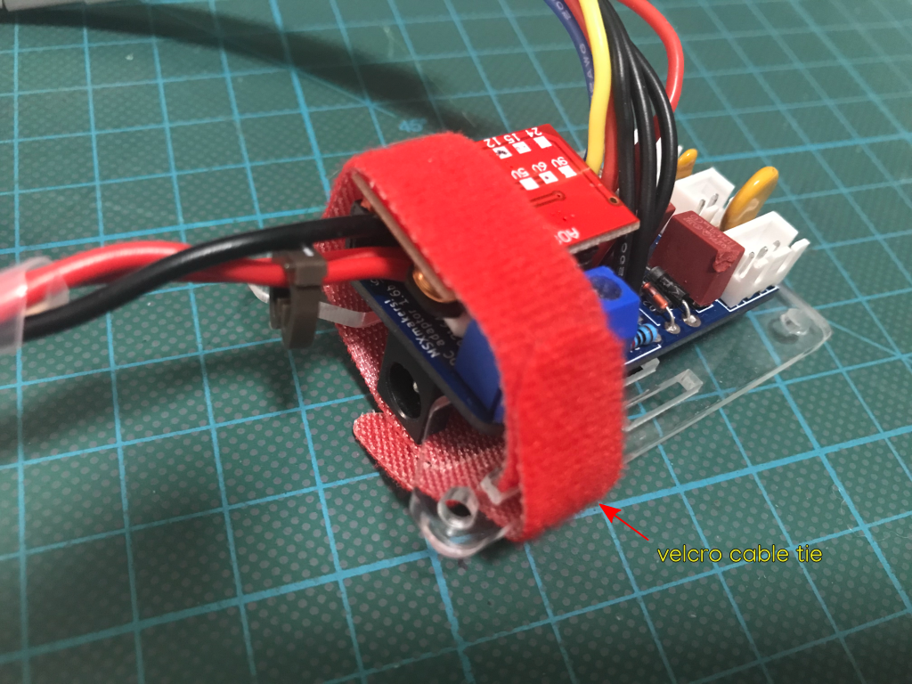

# Build Instructions for the dc-adapter tray

This document describes how to assemble the dc-adapter tray for the MSXmakers! dc-adapter power board for the Omega Home Computer.

## Bill of Materials (BoM)

## Acrylic parts

### dc-adapter tray (3mm thickness)

Optional tray for the MSXmakers! dc-adapter 1.5-1.6b.  
This [dc-adapter tray](dc-adaptor-1.6-tray+ready-to-lasercut-final.dxf) can be used to secure the dc-adapter within the computer case when not in the "inverted-power-barrel" or "anchored-switch" configurations.

Dimensions : 64.50mm x 42.67mm x 3mm

## Laser cutting

The dc-adapter tray CAD design has 2 layers that must be processed in this order using a 3mm acrylic sheet:

|    Layer Name   | Color | Operation | Required  |             Comment            | Processing Order |
|:---------------:|-------|:---------:|-----------|:------------------------------:|:----------------:|
| INT             | red   |    cut    | mandatory |          Internal cuts         |         1        |
| EXT             | green |    cut    | mandatory |          External cuts         |         2        |

## Mechanical parts

| **item**                     | **count** | **style**         | **material**    | **color**  | **length (mm)** | **link**                                                            |
| ---------------------------- | --------- | ----------------- | --------------- | ---------- | --------------- | ------------------------------------------------------------------- |
| Velcro self fastening tie    | 1         | T-type            | nylon fabric    | red        | 150             | [aliexpress](https://www.aliexpress.com/item/1005002179614650.html) |

## Step by step instructions

1. Prepare the dc-adapter tray

You will need the following parts:
  * 1x dc-adapter 1.5-1.6b
  * 1x acrylic dc-adapter tray
  * 1x velcro self fastening tie

2. Add a velcro strip to the dc-adapter tray

3. Place the dc-adapter on the dc-adapter tray and secure it with the velcro strip

