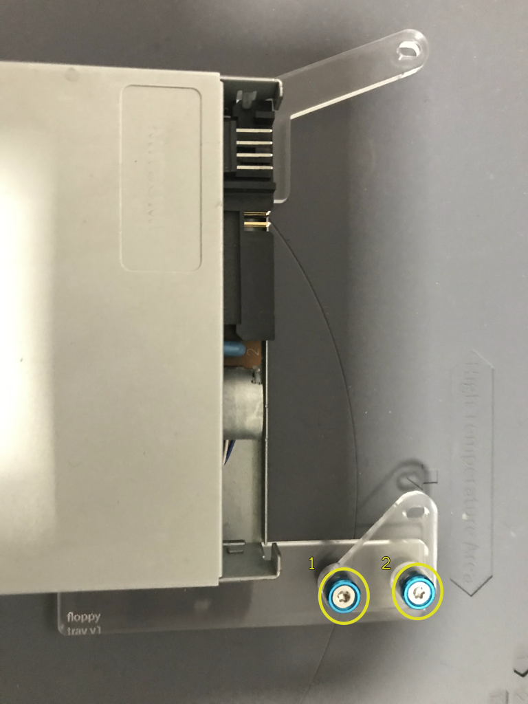

# Build Instructions

This document describes how to assemble the floppy disk drive tray for the Omega Home Computer X3L case.

## Bill of Materials (BoM)

## Acrylic parts

### [Floppy Disk Drive (FDD) tray (3mm thickness)](omega-case-x3l-v1-floppy-tray-3mm%2Bready-to-lasercut-final.dxf)

Tray for the floppy disk drive.  
This tray can be used to attach the floppy disk drive to the computer case.  

The tray is made up of the following elements:
* acrylic floppy tray
* acrylic spacers (12x prepared, but only 2x needed)
* acrylic wing

Dimensions : 179.41mm x 144.46mm x 3mm

## Laser cutting

The floppy disk drive tray CAD design has 3 layers that must be processed in this order:

|    Layer Name   | Color | Operation | Required  |             Comment            | Processing Order |
|:---------------:|-------|:---------:|-----------|:------------------------------:|:----------------:|
|    engraving    | blue  |  engrave  | optional  | Contains only versioning label |         1        |
| floppy-tray-int | red   |    cut    | mandatory |          Internal cuts         |         2        |
| floppy-tray-ext | green |    cut    | mandatory |          External cuts         |         3        |

## Mechanical parts

XXX

## Step by step instructions

1. Prepare the required material:

  * 1x floppy disk drive

  * 1x acrylic floppy tray
  * 2x acrylic spacers
  * 1x acrylic wing
  * 4x M3 8mm flat torx screws
  * 2x M3 14mm countersunk torx screws
  * 2x M3 countersunk washers
  * 2x M3 nuts

2. Turn the floppy drive and acrylic floppy tray upside down and attach the floppy tray to the floppy drive bottom using four M3 8mm flat torx screws

3. Turn the acrylic floppy tray again so that the floppy is in the normal orientation, and prepare to install the acrylic wing by placing the two acrylic spacers on top of the screw holes in the acrylic floppy tray

4. Place the acrylic wing on top of the acrylic spacers and attach it using two M3 14mm countersunk torx screws and countersunk washers

5. Use two M3 nuts on the bottom side to secure the two M3 screws installed on the previous step

6. Once installed, the acrylic wing will look like this as seen from the right side of the floppy disk drive

