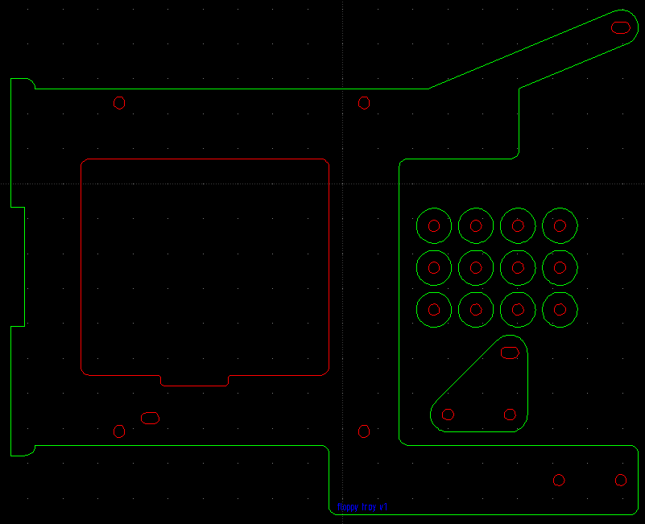
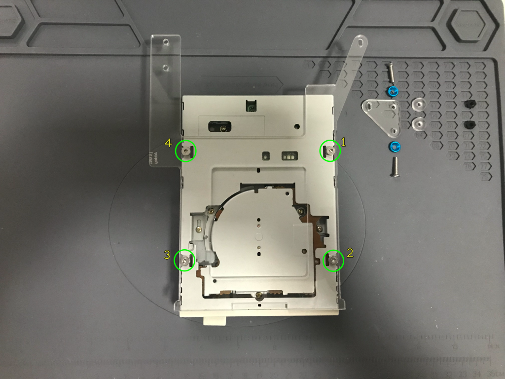

# Build Instructions

This document describes how to assemble the floppy disk drive tray for the Omega Home Computer X3L case.

## Bill of Materials (BoM)

### Acrylic parts

#### [Floppy Disk Drive (FDD) tray (3mm thickness)](omega-case-x3l-v1-floppy-tray-3mm%2Bready-to-lasercut-final.dxf)

Tray for the floppy disk drive.  
This tray can be used to attach the floppy disk drive to the computer case.  

The tray is made up of the following elements:
* acrylic floppy tray
* acrylic spacers (12x prepared, but only 2x needed)
* acrylic wing

Dimensions : 179.41mm x 144.46mm x 3mm

### Laser cutting

The floppy disk drive tray CAD design requires a 3mm thick acrylic sheet and has 3 layers that must be processed in this order:

|    Layer Name   | Color | Operation | Required  |             Comment            | Processing Order |
|:---------------:|-------|:---------:|-----------|:------------------------------:|:----------------:|
|    engraving    | blue  |  engrave  | optional  | Contains only versioning label |         1        |
| floppy-tray-int | red   |    cut    | mandatory |          Internal cuts         |         2        |
| floppy-tray-ext | green |    cut    | mandatory |          External cuts         |         3        |

### Mechanical parts

| **item**                     | **count** | **style**         | **material**    | **color**  | **length (mm)** | **link**                                                            |
| ---------------------------- | --------- | ----------------- | --------------- | ---------- | --------------- | ------------------------------------------------------------------- |
| M3 nut                       | 2         | hex               | nylon           | black      | 2               | [aliexpress](https://www.aliexpress.com/item/32859166254.html)      |
| M3 screw 14mm countersunk    | 2         | countersunk, torx | stainless steel | metal      | 14              | [aliexpress](https://www.aliexpress.com/item/1005002369233576.html) |
| M3 screw 8mm flat            | 4         | flat, torx        | stainless steel | metal      | 8               | [aliexpress](https://www.aliexpress.com/item/1005003098981878.html) |
| M3 washer countersunk        | 2         | countersunk       | aluminium       | light blue | 2               | [aliexpress](https://www.aliexpress.com/item/32968161596.html)      |

## Step by step instructions

1. Prepare the required material:

  * 1x floppy disk drive

  * 1x acrylic floppy tray (laser cut part)
  * 2x acrylic spacers (laser cut part)
  * 1x acrylic wing (laser cut part)
  * 4x M3 8mm flat torx screws
  * 2x M3 14mm countersunk torx screws
  * 2x M3 countersunk washers
  * 2x M3 nuts

The floppy drive bottom is attached to the floppy tray via four screws.  
Also part of the floppy tray is an elevated wing used to attach the floppy tray to the computer case without colliding with the F4/FMPAC v2 hat. The wing serves aswell as a stop for the keyboard in case excessive force is applied to the keyboard panel top/center.

2. Turn the floppy drive and acrylic floppy tray upside down and attach the floppy tray to the floppy drive bottom using four M3 8mm flat torx screws

3. Turn the acrylic floppy tray again so that the floppy is in the normal orientation, and prepare to install the acrylic wing by placing the two acrylic spacers on top of the screw holes in the acrylic floppy tray

4. Place the acrylic wing on top of the acrylic spacers and attach it using two M3 14mm countersunk torx screws and countersunk washers

5. Use two M3 nuts on the bottom side to secure the two M3 screws installed on the previous step

6. Once installed, the acrylic wing will look like this as seen from the right side of the floppy disk drive

